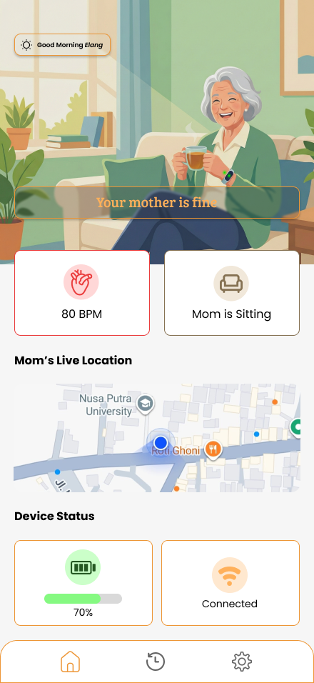
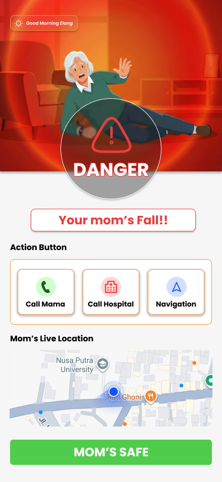
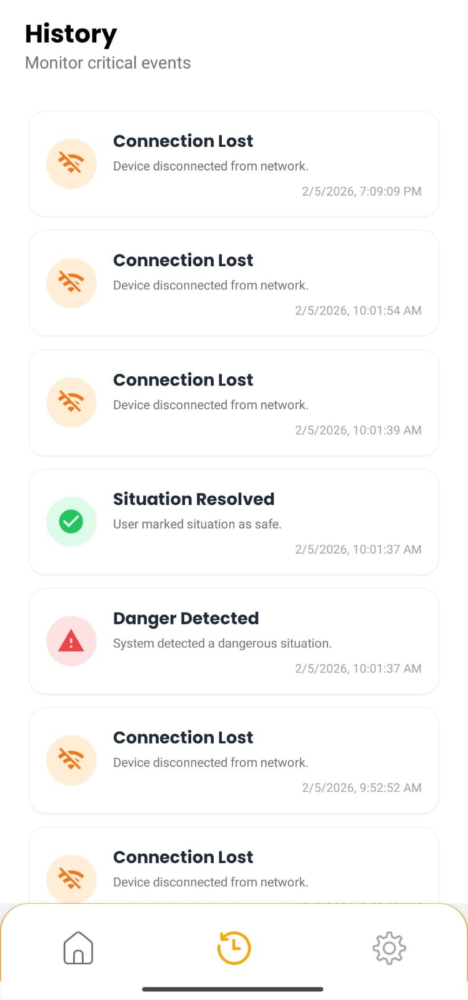
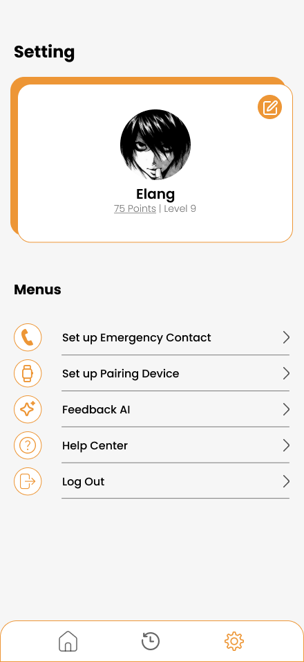

# 👵 PantauOma - Elderly Monitoring System

  
   
   
  

    <b>"Pantau orang tua tercinta, kapan saja, di mana saja."</b>
  

---

PantauOma adalah aplikasi mobile berbasis **Internet of Things (IoT)** yang dirancang untuk memantau keselamatan lansia secara real-time. Aplikasi ini terintegrasi dengan perangkat wearable untuk mendeteksi lokasi, detak jantung, aktivitas user dan insiden jatuh (fall detection) menggunaka algoritma Random Forest. (IoT & AI masih dalam pengembangan)

---

## 📱 Demo & Screenshots

### Live Demo
Video demo penggunaan aplikasi dapat dilihat melalui link berikut:

### [▶️ Tonton Video Demo (Google Drive)](https://drive.google.com/file/d/1XSpqkAtIVNqIEo5XyNafp79Hvc3C1UGs/view?usp=sharing)

### Gallery
| Home (Safe Condition) | Home (Danger Alert) | History Page | Profile Page |
|:---:|:---:|:---:|:---:|
|  |  |  |  |

---

## ⚙️ System Architecture

Berikut adalah alur data bagaimana PantauOma bekerja, mulai dari sensor wearable hingga notifikasi di HP anak/wali.

---

## 🚀 Key Features

* **📍 Live Location Tracking:** Melacak posisi lansia secara real-time menggunakan peta interaktif (Leaflet/Google Maps).
* **❤️ Health Monitoring:** Menampilkan detak jantung (BPM) dan status aktivitas (Duduk/Berjalan).
* **⚠️ Fall Detection Alert:** Notifikasi instan layar merah "Danger" ketika perangkat mendeteksi lansia terjatuh.
* **🔋 Device Status:** Memantau persentase baterai perangkat wearable dan koneksi Wi-Fi.
* **🌙 Offline Mode:** Data tersimpan lokal menggunakan **SQLite**, memungkinkan riwayat tetap bisa diakses tanpa internet.
* **🎨 Glassmorphism UI:** Tampilan modern dengan efek blur native dan animasi halus.

---

## 🛠️ Tech Stack

**Mobile Framework:**
*  **Expo SDK 50+**
* 
* **NativeWind v4** (TailwindCSS for Native)

**Native Modules:**
* `expo-sqlite` (Local Database)
* `expo-blur` (Glass UI Effect)
* `react-native-maps` / `react-native-webview` (Mapping)
* `expo-location` (GPS)

**Backend & Services:**
*  (Realtime Database & Auth)
* **Google Maps API** / **OpenStreetMap**

---
